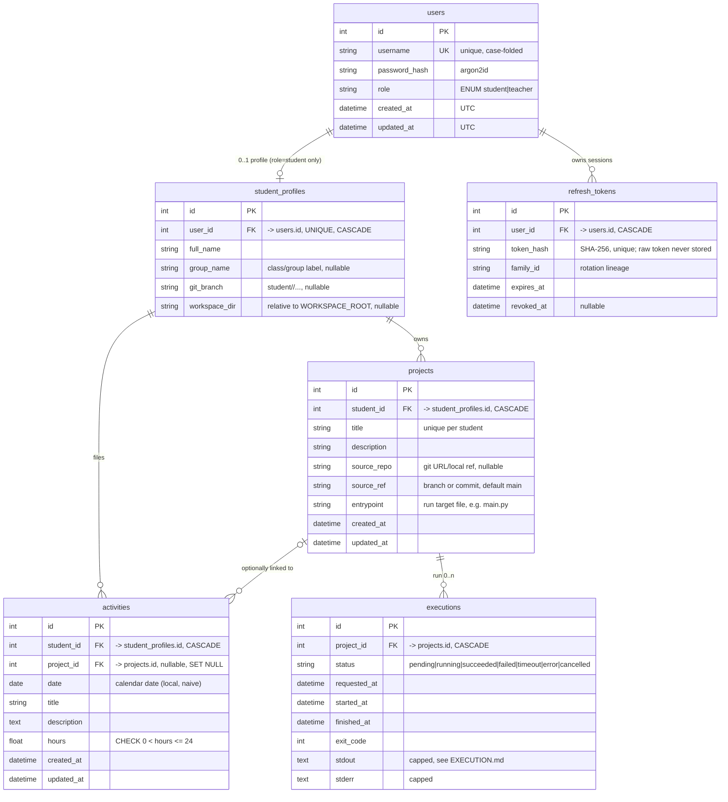

# StudentLab — Database Design

[CURRENT] **No database exists**: no models, no migrations, no `.db` file, no ORM or
driver dependencies. This document is the [TARGET] design and its conventions.
Nothing here is implemented yet.

## 1. Engine & Tooling — [TARGET]

| Concern | Decision |
|---------|----------|
| Engine | SQLite, file `backend/studentlab.db` (path from `settings.DATABASE_URL`) |
| ORM | SQLAlchemy 2.x, fully typed `DeclarativeBase`/`Mapped[...]` style |
| Migrations | Alembic, `backend/alembic/`, autogenerate enabled (see §7 for discipline) |
| Driver | `sqlite3` (sync). No async DB (ADR: sync sessions everywhere) |
| Tests | `pytest` fixtures build a **tmp-file SQLite per test** (file, not `:memory:`+StaticPool, so SQLite quirks behave identically to prod) |
| Future | Postgres swap path documented in §8; do not build for it yet |

## 2. ERD — [TARGET]

Ownership invariant, normative: `users` rows never own content directly — every
content row hangs off `student_profiles.id`, and `executions` derive their student
ownership transitively through `project`. Executions have no `student_id` column by
design (no drift). The single ownership path is the basis of every check in
SECURITY.md §3.

## 3. Tables (column contract) — [TARGET]

Conventions: snake_case; every table gets `created_at` (server default now, UTC) and
mutable rows also `updated_at` (ORM-updated); integer surrogate PKs `id`; FKs named
`fk_<table>_<col>`; indexes `ix_<table>_<cols>`; unique `uq_<table>_<cols>`
(SQLAlchemy `naming_convention` in `core/database.py` — required so Alembic can drop
constraints reliably).

### `users`
| Column | Type | Constraints |
|--------|------|-------------|
| id | INTEGER | PK |
| username | VARCHAR(32) | NOT NULL UNIQUE; app-side check `^[a-z0-9_]{3,32}$` (stored lowercase) |
| password_hash | VARCHAR(255) | NOT NULL; argon2id; never serialized in any schema |
| role | VARCHAR(10) | NOT NULL, `IN ('student','teacher')` CHECK |
| is_active | BOOLEAN | NOT NULL default 1 (disable instead of delete) |
| created_at / updated_at | DATETIME | NOT NULL UTC |

### `student_profiles` (student-specific data; 1:1 with a `student` user)
| Column | Type | Constraints |
|--------|------|-------------|
| id | INTEGER | PK |
| user_id | INTEGER | FK users CASCADE, NOT NULL UNIQUE |
| full_name | VARCHAR(100) | NOT NULL |
| group_name | VARCHAR(50) | nullable (class/group label) |
| git_branch | VARCHAR(100) | nullable; canonical student branch prefix (GIT_WORKFLOW.md) |
| workspace_dir | VARCHAR(200) | nullable, unique; **relative** path under WORKSPACE_ROOT; no absolute paths, no `..` (validated) |

Invariant: a `teacher` user MUST NOT have a profile row (enforced in `user_service`,
CHECK not practical cross-table). Deleting a user cascades everything; that is why
normal flow is `is_active=0`.

### `projects`
| Column | Type | Constraints |
|--------|------|-------------|
| id | INTEGER | PK |
| student_id | INTEGER | FK student_profiles CASCADE, NOT NULL |
| title | VARCHAR(120) | NOT NULL; UNIQUE `(student_id, title)` |
| description | TEXT | default '' |
| source_repo | VARCHAR(300) | nullable — "project source/reference": git URL or path; workspace is materialized from it (EXECUTION.md §6) |
| source_ref | VARCHAR(100) | default 'main' |
| entrypoint | VARCHAR(200) | NOT NULL, e.g. `main.py`; validated: relative, inside workspace, `.py`/allowlisted ext |
| created_at / updated_at | DATETIME | NOT NULL |

Index `ix_projects_student_id`. Ownership = `student_id`. **No soft-delete**;
deleting a project cascades its executions (see §5).

### `activities` (the single "Activity / Report" entity) — [DECISION]
Reports and calendar entries are the *same rows*, two views of one table. Do not
create a second `reports` table later; if a distinction is ever needed, add a
`kind` column, don't fork the table.

| Column | Type | Constraints |
|--------|------|-------------|
| id | INTEGER | PK |
| student_id | INTEGER | FK student_profiles CASCADE, NOT NULL |
| project_id | INTEGER | FK projects SET NULL, nullable |
| date | DATE | NOT NULL (naive local calendar date — §4 timezone rule) |
| title | VARCHAR(150) | NOT NULL |
| description | TEXT | default '' |
| hours | FLOAT | NOT NULL CHECK `> 0 AND <= 24` |
| created_at / updated_at | DATETIME | NOT NULL |

Indexes: `ix_activities_student_date (student_id, date)` (powers calendar +
monthly reports), `ix_activities_project (project_id)`.
Uniqueness: intentionally none (multiple reports per day per project are normal).

### `executions`
| Column | Type | Constraints |
|--------|------|-------------|
| id | INTEGER | PK |
| project_id | INTEGER | FK projects CASCADE, NOT NULL |
| status | VARCHAR(12) | NOT NULL CHECK in (`pending`,`running`,`succeeded`,`failed`,`timeout`,`error`,`cancelled`) — Python enum members upper-case, stored values lower-case (EXECUTION.md §5) |
| requested_at | DATETIME | NOT NULL |
| started_at / finished_at | DATETIME | nullable |
| exit_code | INTEGER | nullable (NULL until finished) |
| image_digest | VARCHAR(80) | nullable — which runner image ran it (audit) |
| stdout | TEXT | capped ≤ 64 KiB (truncate with marker, EXECUTION.md) |
| stderr | TEXT | capped ≤ 64 KiB |
| error | VARCHAR(200) | nullable — platform-level failure reason (docker_unavailable, quota…) |

Index `ix_executions_project_status (project_id, status)`. Student ownership is
*transitive*: `execution → project → student_profiles`. Permission checks follow
that join — there is deliberately **no** redundant `student_id` column to drift.
(Add one later only if query plans ever demand it; the spec says don't.)

## 4. Cross-cutting rules — [TARGET]

- **Time**: all `DATETIME` = naive UTC (store `datetime.now(timezone.utc)`
  truncated to naive at boundary — pick ONE helper `core/time.py:utcnow()`);
  `activities.date` = naive local **calendar date** chosen by the user; no
  timezone conversion on it ever. Documented, because calendar bugs live here.
- Enums: Python `enum.StrEnum`; DB enforces via CHECK (SQLite has no native enum).
  Status/role values are lowercase strings.
- No `TIMESTAMP` type; SQLite datetime affinity via `DATETIME`.
- Every mutation goes through a service in one transaction; repositories do not
  commit.
- IDs are sequential integers — fine locally, but API errors for foreign
  `student_id` must be 404 (SECURITY.md §6), not an information channel.

## 5. Cascade semantics — [TARGET]

| Parent delete | Effect |
|---------------|--------|
| users | CASCADE → student_profiles → projects, activities; projects CASCADE → executions. Teacher "delete" of a student = full wipe → service requires explicit `confirm=true` flag in the request (UI double-confirm) |
| projects | SET NULL on `activities.project_id` **and** CASCADE on executions — history of a deleted project is dropped; documented trade-off: storage hygiene beats forensic retention for this app (add retention decision in GIT_WORKFLOW "special review" list if teacher disagrees) |
| student_profiles row without deleting user | Only `user_service.deactivate` path; keeps FK graph simple |

`PRAGMA foreign_keys=ON` is REQUIRED per connection (SQLite default is off!) —
installed by an engine `connect` event in `core/database.py`; a startup assertion
`SELECT foreign_keys` runs in lifespan and fails fast. This is the #1 silent
integrity bug in SQLite projects; treat as merge-blocking if the event handler
disappears.

## 6. Session & concurrency — [TARGET]

- `sessionmaker` bound to engine created once in `core/database.py`; per-request
  session via `Depends(get_db)`; commit only in `get_db` on success.
- `connect` args: `check_same_thread=False` (uvicorn threads may reuse the pool),
  pool_size small + `NullPool`-style per-thread is acceptable; keep default QueuePool.
- SQLite pragmas on connect: `foreign_keys=ON`, `journal_mode=WAL`,
  `busy_timeout=5000`, `synchronous=NORMAL`. WAL allows readers concurrent with the
  single writer; class-size write contention (executions inserting often) is the
  known limit → §8.
- The execution worker uses its **own** sessions (never the request's).

## 7. Migration discipline — [TARGET]

- Autogenerate after adding/editing models; **human/teacher reviews every
  migration file before merge** (autogenerate can silently drop things).
- One PR = at most one new revision; revision filename `<slug>_<yyyymmddHHMM>.py`;
  message = PR title.
- Students editing models: allowed **only** for tables they own (§ ownership,
  GIT_WORKFLOW.md §6); shared-table changes (users, student_profiles) require
  teacher-authored migration.
- Before merge: `git rebase main`, then `alembic heads` must print exactly one
  head; CI enforces (script `scripts/check_migration_heads.sh`).
- `downgrade` must exist and run in tests (`upgrade → downgrade -1 → upgrade`) —
  catches most bad autogenerations.
- Seed data: `scripts/seed.py --dev` creates teacher + demo students; never
  committed `.db` files (root `.gitignore` excludes `*.db`, `*.sqlite3` —
  already in place from Step 0).

## 8. Postgres escape hatch — [TARGET, dormant]

If concurrency or data volume outgrows SQLite: same SQLAlchemy models work against
Postgres; only `core/database.py` (engine/pragmas), server-default `DATETIME`s, and
float `hours` (→ Numeric) need edits; Alembic renders DDL per dialect. **Do not
build dual-dialect support now**; the only Step-1+ obligation is to keep dialect
specifics out of repositories/services.

## 9. Open data questions (human decisions)

1. Should `activities.hours` support 0 (planned-zero day)? Currently CHECK `>0`.
2. Do teachers need historical executions after project deletion (forensics)?
   Currently no (CASCADE).
3. `group_name` vs a real `classes` table — one teacher + few groups says a column
   suffices; revisit if class count grows.
